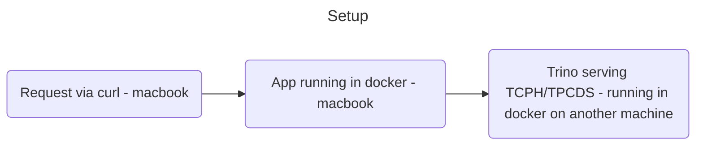

# rest-test

A quite unimaginative name for a repo. I created this repo as I wanted to measure, seconds and memory, getting data back (via HTTP/S) from a large dataset. The added constraint was, this had to be run in a docker container with memory and cpu limited (as it would in a Kubernetes cluster).

## Test setup
The test setup I had:
* Trino (`v415`) running in a docker container serving back TPCDS/TPCH dataset running on a separate machine
* Docker (`v4.26.1`) running on a M3 Macbook with 32GB ram. Resources - was set to 12 Cores,  Memory - 18GB
* curl (`curl 8.4.0 (x86_64-apple-darwin23.0)`) running on the same M3 macbook.
* grpcurl (`1.8.9`) running on the same M3 macbook.




## The apps
The app would be running in Docker on M3 and it connects to Trino via the JDBC driver and runs a simple `SELECT` on the `ORDERS` table. There were 2 end points for the apps
* One end-point to read all the data and serve it back via a large JSON. If the header `Accept-Encoding: gzip` is set, the response would be gzipped.
* The other end-point to stream the data back in real time as its made available (each row would translate to a JSON message and sent back). Again, if the header `Accept-Encoding: gzip` is set, the response would be gzipped.

The `ORDERS` table is about 330MB in size.

## The frameworks tested

1. GoLang
1. Springboot - Tomcat
1. Springboot - Jetty (undertow)
1. [MuServer](https://muserver.io) - which is Netty
1. GRPC - Springboot - In progress of testing
1. GRPC - Netty - In progress of testing
1. GRAAL (compiling java into native) - Not started

## What did I track

Tracked how long the curl request took to complete and how much ram was used - I used the `time` command and `docker stats`

Ex.

```sh
#To get the GZIPPed response
time curl -H "Accept-Encoding: gzip" http://localhost:8181/stream/orders -o orders.json.gz`

#To get the json instead
time curl -H "Content-Type: application/json" http://localhost:8181/stream/orders -o items.json

#To test HTTP2
time curl -v --http2-prior-knowledge http://localhost:8181/orders -o /tmp/orders.json

#To Test GRPC - this requires grpcurl - https://github.com/fullstorydev/grpcurl
time grpcurl --plaintext localhost:8080 io.github.parj.testrest.OrdersServiceImpl.StreamOrders > /tmp/orders.json
```

## The results

Also in csv format -> [stats.csv](stats.csv)

| Language | Version   | Arch  | Tech                              | Stream | GZIP | Type                                                         | Time taken (seconds) | Memory taken (MiB) |
| -------- | --------- | ----- | --------------------------------- | ------ | ---- | ------------------------------------------------------------ | -------------------- | ------------------ |
| Go       | 1.21.5    | ARM64 | Go                                | Y      | Y    | Stream - GZIP                                                | 14.335               |           34.70    |
| Go       | 1.21.5    | ARM64 | Go                                | Y      | N    | Stream - JSON                                                | 14.721               |           23.80    |
| Go       | 1.21.5    | ARM64 | Go                                | N      | Y    | No Stream - GZIP                                             | 20.772               |      2,130.94      |
| Go       | 1.21.5    | ARM64 | Go                                | N      | N    | No Stream - JSON                                             | 16.384               |      2,022.40      |
| Java     | 17.0.9+9  | ARM64 | Springboot - Tomcat               | N      | N    | Springboot - Tomcat - No Stream - JSON                       | 14.627               |      1,560.58      |
| Java     | 17.0.9+10 | ARM64 | Springboot - Tomcat               | N      | Y    | Springboot - Tomcat - No Stream - GZIP                       | 17.29                |      1,718.27      |
| Java     | 17.0.9+11 | ARM64 | Springboot - Tomcat               | Y      | N    | Springboot - Tomcat - Stream - JSON                          | 27.368               |      1,602.56      |
| Java     | 17.0.9+12 | ARM64 | Springboot - Tomcat               | Y      | Y    | Springboot - Tomcat - Stream - GZIP                          | 44                   |      1,620.99      |
| Java     | 17.0.9+13 | ARM64 | Springboot - Tomcat - Without JPA | Y      | N    | Springboot - Tomcat - Without JPA - Stream - JSON            | 20.33                |         577.00     |
| Java     | 17.0.9+14 | ARM64 | Springboot - Tomcat - Without JPA | Y      | Y    | Springboot - Tomcat - Without JPA - Stream - GZIP            | 30.269               |         727.00     |
| Java     | 17.0.9+15 | ARM64 | Springboot - Tomcat - HTTP2       | N      | N    | Springboot - Tomcat - HTTP2 - No Stream - JSON               | 15.686               |      1,582.06      |
| Java     | 17.0.9+16 | ARM64 | Springboot - Tomcat - HTTP2       | Y      | N    | Springboot - Tomcat - HTTP2 -  Without JPA - Stream - JSON   | 22.82                |         634.10     |
| Java     | 17.0.9+17 | ARM64 | Springboot - Tomcat - HTTP2       | N      | Y    | Springboot - Tomcat - HTTP2 - No Stream - GZIP               | 18.773               |      1,631.23      |
| Java     | 17.0.9+18 | ARM64 | Springboot - Tomcat - HTTP2       | Y      | Y    | Springboot - Tomcat - HTTP2 -  Without JPA - Stream - GZIP   | 30.413               |         668.20     |
| Java     | 17.0.9+19 | ARM64 | Springboot - Undertow             | N      | N    | Springboot - Undertow - No Stream - JSON                     | 14.552               |      1,611.78      |
| Java     | 17.0.9+20 | ARM64 | Springboot - Undertow             | N      | Y    | Springboot - Undertow - No Stream - GZIP                     | 19.379               |      1,742.85      |
| Java     | 17.0.9+21 | ARM64 | Springboot - Undertow             | Y      | N    | Springboot - Undertow - Stream - Without JPA - JSON          | 25.238               |         615.00     |
| Java     | 17.0.9+22 | ARM64 | Springboot - Undertow             | Y      | Y    | Springboot - Undertow - Stream - Without JPA - GZIP          | 11.927               |         404.00     |
| Java     | 17.0.9+22 | ARM64 | Springboot - Undertow - HTTP2     | Y      | N    | Springboot - Undertow - HTTP2 -  Without JPA - Stream - JSON | 29                   |         600.10     |
| Java     | 17.0.9+22 | ARM64 | Springboot - Undertow - HTTP2     | Y      | Y    | Springboot - Undertow - HTTP2 -  Without JPA - Stream - GZIP | 11.633               |         424.60     |
| Java     | 17.0.9+22 | ARM64 | Springboot - Undertow - HTTP2     | N      | N    | Springboot - Undertow - HTTP2 - No Stream - JSON             | 14.381               |      1,533.95      |
| Java     | 17.0.9+22 | ARM64 | Springboot - Undertow - HTTP2     | N      | Y    | Springboot - Undertow - HTTP2 - No Stream - GZIP             | 17.639               |      1,619.97      |
| Java     | 17.0.9+23 | ARM64 | MuServer                          | Y      | N    | MuServer - Stream - JSON                                     | 12.95                |         338.20     |
| Java     | 17.0.9+24 | ARM64 | MuServer                          | Y      | Y    | MuServer - Stream - GZIP                                     | 12.986               |         396.80     |
| Java     | 17.0.9+25 | ARM64 | MuServer                          | N      | N    | MuServer - No Stream - JSON                                  | 19.45                |      3,686.40      |
| Java     | 17.0.9+26 | ARM64 | MuServer                          | N      | Y    | MuServer - No Stream - GZIP                                  | 23.236               |      3,234.82      |
| Java     | 17.0.9+26 | ARM64 | NettyServer                       | Y      | N    | NettyServer - Stream - GRPC - JSON                           | 15.621               |      1,969.15      |
| Java     | 17.0.9+22 | ARM64 | Springboot - Tomcat - GRPC        | Y      | N    | Springboot - Tomcat - GRPC - JSON                            | 14.913               |      1,906.69      |


## TO-DO

- [ ] Add tests
- [ ] Complete GRPC testing
- [ ] Add larger data sets
- [ ] Publish the jars and docker images
- [ ] Add monitoring via either jmx-exporter or opentelemetry
- [ ] Capture more indepth jvm metrics
- [ ] Write a shell script to automate running and capturing the data